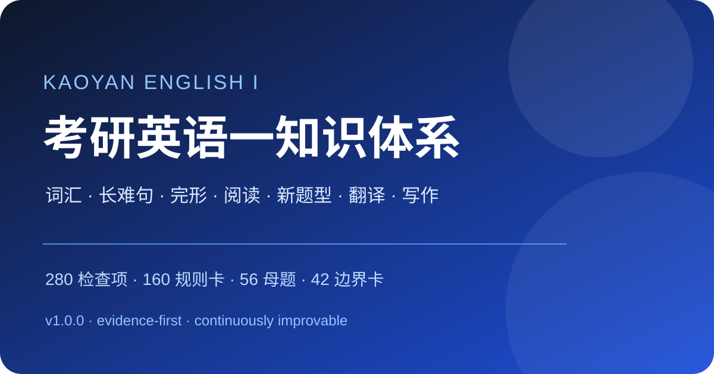

# 考研英语一知识体系

> 一套可持续迭代、可挂接真题与错题、可发布为网站的考研英语（一）知识库。

<p align="center">
  
</p>

## 当前版本

**v1.0.0 · 2026-08-25**

| 模块 | 当前规模 |
| --- | ---: |
| 三级知识点检查项 | 280 |
| 核心规则卡 | 160 |
| 典型真题母题 | 56 |
| 错误命题与失效边界 | 42 |
| 个人高频疑问挂接 | 13 |
| 高频任务决策树 | 12 |

## 核心结构

- **八大主模块**：词汇 `V`、语法 `G`、完形 `C`、阅读 `R`、新题型 `N`、翻译 `T`、写作 `W`、方法 `M`。
- **证据优先**：客观题记录最小证据区间和错项机制，翻译/写作记录二稿与迁移规则。
- **固定编号**：真题、错题和个人问题可挂到 `K/Q/B/J` 编号，长期更新不打乱索引。
- **数据闭环**：内置掌握度、真题、错题、词汇、长难句、翻译和写作 CSV 模板。
- **网站发布**：内置 Zensical 与 GitHub Actions，可部署为 GitHub Pages。

## 快速阅读

- [体系总览](docs/00-overview.md)
- [词汇与语义](docs/01-vocabulary.md)
- [语法与长难句](docs/02-grammar-long-sentences.md)
- [阅读理解 A](docs/04-reading.md)
- [英译汉](docs/06-translation.md)
- [写作](docs/07-writing.md)
- [规则卡](docs/11-rule-cards.md)
- [母题索引](docs/13-problem-archetypes.md)
- [边界库](docs/14-counterexamples.md)
- [官方范围与年度核对](docs/18-official-scope.md)

## 下载单文件版本

- [考研英语一知识体系 v1.0.0（Markdown）](docs/downloads/考研英语一知识体系_v1.0.0.md)

## 本地使用

```bash
python -m venv .venv
# Windows: .venv\Scripts\Activate.ps1
# macOS/Linux: source .venv/bin/activate
pip install -r requirements.txt
python scripts/validate_project.py
zensical serve
```

构建单文件 Markdown：

```bash
python scripts/build_bundle.py
```

## 推荐维护流程

1. 做题后记录年份、题号、母题 ID、节点、正确率、用时和错误标签。
2. 客观题写最小证据与错项机制；翻译/写作必须完成二稿。
3. 3/7/14 天回测，依据真实表现升降节点等级。
4. 修改正文后运行校验与网站构建，再提交 Pull Request。

## 仓库结构

```text
.
├─ docs/        # 分章节知识库与网站正文
├─ data/        # 掌握度、真题、错题、词汇、长难句、翻译与写作模板
├─ scripts/     # 结构校验与单文件打包
├─ releases/    # 版本快照说明
├─ .github/     # Actions、Issue 与 PR 模板
├─ zensical.toml
├─ CHANGELOG.md
└─ ROADMAP.md
```

## 内容与版权说明

本项目默认面向考研英语（一），但不替代报考年度官方考试大纲。项目不收录未经授权的整套真题、文章全文、付费课程或大段教材内容；建议只记录年份、题号、原创解析和简短证据摘要。

## 许可

- 原创知识体系与文字：CC BY-NC-SA 4.0（见 `LICENSE`）。
- 脚本、配置与工作流：MIT（见 `LICENSE-CODE`）。
